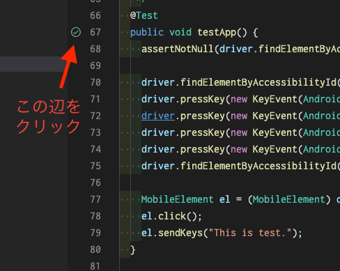

# AppCenter-Android-AutoTest-Sample

AppCenter上でAndroidの自動テストを行うサンプル。Appiumを利用。

## 環境構築(Mac)

### 動確済みバージョン

MacBook Air 2020 M1 で確認。

| ツール | バージョン | 備考 |
|------|-----|-----|
| Java | AdoptOpenJDK (build 1.8.0_292-b10) |
| [Android Studio](https://developer.android.com/studio) | 2021.1.1 Patch 2 for Mac |
| [Appium Desktop](https://github.com/appium/appium-desktop/releases) | 1.22.2 |
| [Appium Inspector](https://github.com/appium/appium-inspector/releases) | 2022.2.1 | 実行には不要。要素名確認等に使う。|
| VSCode plugin : Extension Pack for Java | 0.22.2 |
| [AppCenter CLI](https://docs.microsoft.com/ja-jp/appcenter/cli/) | 2.10.8 | nodeが必要。`npm install -g appcenter-cli` |

### Install

上の表のツールを一通りインストール。

- Android Studio（SDK）
  - [ここ](https://akira-watson.com/android/adt-mac.html)を見た
  - SDK最新(12)を追加、System Imageも追加
  - ~/.zshrc等に環境変数追加

    ```sh
    export ANDROID_SDK_ROOT=~/Library/Android/sdk
    ```

- Appium Desktop
  - ハマリポイント
    - Appium DesktopのUI（環境変数設定）に設定が必要（無いとエラー）
      - ANDROID_HOMEにSDKのパス(↑と同じ)を入れる（[参考](https://stackoverflow.com/questions/65439683/neither-android-home-nor-android-sdk-root-environment-variable-was-exported-wi)）

## ローカルでのテスト実行

1. <details><summary>エミュレーター起動</summary><div>

    - Android Studio の Device Managerから (下記UI)
    
    
    </div></details>

2. <details><summary>Appiumサーバー起動</summary><div>

    
    </div></details>

3. テスト実行
   - <details><summary>方法①： テストメソッド実行</summary><div>

       
     </div></details>

   - <details><summary>方法②： Mavenプラグインから実行</summary><div>

       
     </div></details>

   - <details><summary>方法③： Mavenコマンドラインで実行</summary><div>

       ```sh
       mvn verify -f "./pom.xml"
       ```
     </div></details>

## AppCenterでの実行方法

1. (loginしてなければ) `appcenter login` を実行
2. `run` タスクを実行
    
    

<details><summary>参考：runタスクの中身</summary><div>

- テストクラスや依存ライブラリを `target/upload` にパックする

    ```sh
    mvn -DskipTests -P prepare-for-upload package
    ```

- それをアップロードして実行する

    ```sh
    appcenter test run appium --app "hoge-mozkzki/FirstTestApp" --devices "hoge-mozkzki/test-set-android-1" --app-path ./ApiDemos-debug.apk --test-series "master" --locale "ja_JP" --build-dir target/upload
    ```

※ --app, --devices, --test-series, --locale 等は予めAppCenterのUIで作成が必要
</div></details>

## 要素名の確認方法

★テスト作成時に必要な要素名の確認方法を書く

## 参考

- Visual Studio App Center | Microsoft Docs
  - [アプリケーション用の Appium テストのアップロード](https://docs.microsoft.com/ja-jp/appcenter/test-cloud/frameworks/appium/)
  - [テストの実行の開始](https://docs.microsoft.com/ja-jp/appcenter/test-cloud/starting-a-test-run)
  - [レポート](https://docs.microsoft.com/ja-jp/appcenter/test-cloud/test-reports)
- [appium/java-client](https://github.com/appium/java-client)
  - Java language binding for writing Appium Tests, conforms to Mobile JSON Wire & W3C Webdriver Protocol
- [microsoft/AppCenter-Test-Appium-Java-Extensions](https://github.com/microsoft/AppCenter-Test-Appium-Java-Extensions)
  - Extension library to run Appium Java tests on Visual Studio App Center
- [Desired Capabilities - Appium](https://appium.io/docs/en/writing-running-appium/caps/)
- Samples
  - [ShravankarthikGit/AppCenter-Test-Samples-New](https://github.com/ShravankarthikGit/AppCenter-Test-Samples-New)
  - [vishuhanda/appiumappcenter](https://github.com/vishuhanda/appiumappcenter)

## メモ

- Appium自体にはPython I/Fがあるが、AppCenterが対応していない(Java Junit4のみ)
